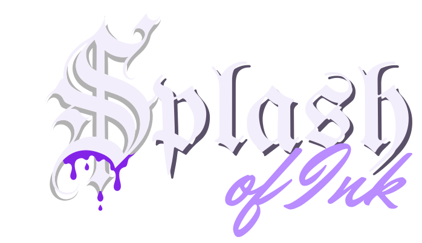
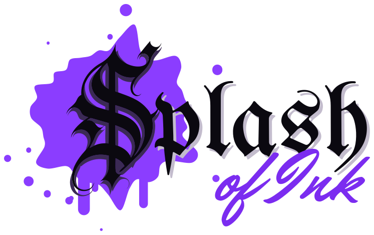

# Splash of Ink: Branding Guidelines

**Draft v0.1 · 2 October 2026 · for the shop to review and change.** This is a starting point, not a locked identity. Magic, Master D and the crew are the artists here; anything in this document can be redrawn, recoloured or thrown out. When something changes, the files in this folder get rebuilt to match.

Prepared by AZ Technology Solutions with the shop, from the conversations of 1 October 2026.

**See it as a page:** https://az-tech-sol.github.io/splash-of-ink-draft-9b9fde/brand/

---

## The marks

There are three pieces, and each has a job.

| Piece | What it is | Use it for |
| --- | --- | --- |
| **Brand mark** | The blackletter **S** on its own spill of purple ink | Avatars, stickers, favicons, the shop window, merch, anywhere the name can't fit |
| **Wordmark** | *plash* in blackletter and *of Ink* in script | Never on its own. It always follows the S |
| **Signature** | The S and its ink spill as the S of *Splash*, then the wordmark | The website header, signs, flyers, cards |

**The signature, on dark (the main version):**

**The signature, on light (paper, receipts, light walls):**

**The brand mark (the shop's pick, 2 October): the clean S on spilled ink:**

### The files

| File | What it's for |
| --- | --- |
| `splash-of-ink-signature-dark.svg` | The signature on dark backgrounds. The website uses this one. |
| `splash-of-ink-signature-light.svg` | The signature on light backgrounds. |
| `splash-of-ink-mark-dark.svg` | The S alone, light letter, no splash, see-through background. |
| `splash-of-ink-mark-light.svg` | The S alone, black letter, no splash, see-through background. |
| `splash-of-ink-avatar.svg` | **The brand mark as the shop chose it (2 Oct):** the clean S on a spilled-ink splash in Ink Purple, with a deep purple shadow. Instagram, TikTok, Google, stickers and merch. |

All of them are true vector files, so they print crisp at any size, from a sticker to a wall.

---

## The S

The S is the heart of the brand. Two things make it ours:

- **West Coast lettering.** It's drawn in the old English style of California Chicano tattoo and sign lettering, with sharp serifs, black and gray shading, and a gray drop shadow.
- **The splash.** The S sits on its own spill of Ink Purple, with drops and runs around it. The splash is the ink, so the letter itself stays clean (the shop's pick, 2 October).

**Its counters are open.** The spaces inside the S are see-through, so the letter reads as an S on any background, even on purple.

### Rules for the S

- Always use the S from these files. Don't retype it in a font: the blackletter font's own S reads like a G or a T (Magic's note, 1 Oct), which is why the drawn S replaced it.
- Keep it upright. Don't stretch, slant or outline it.
- The splash is always Ink Purple. The letter changes between light and dark to suit the background; the splash doesn't.
- Smallest size: 28 px tall on screen, 8 mm in print. Below that, the splash's drops disappear.

---

## The signature

### How it fits together

- **The S is the first letter.** *plash* starts right after the S, tucked close enough that the eye reads one word: *Splash*.
- **The S is about 2.3 times as tall as the tall letters of *plash*** (the l and the h). It reaches above them, and its splash spreads behind the start of the word.
- ***of Ink* is two thirds the size of *plash*,** set under the right half of the word, so it hangs off *Splash* like a signature.
- **Drop shadow:** *plash* carries a shadow offset down and right by about 3% of its size, in dark lilac on dark and pale gray on light.
- **Clear space:** keep empty space around the signature of at least a quarter of the S's height on every side.

### Rules for the signature

- Use the files as they are. Don't re-space, re-letter or rearrange them.
- One splash at a time. The splash lives behind the S. Don't add drips or splashes to the menu bar, borders or other text near the logo, because a second one waters down the first.
- On photos, place the signature where the background is calm and dark, or use the S alone.

---

## Typography

| Where | Face | Notes |
| --- | --- | --- |
| *plash* in the logo | **UnifrakturMaguntia** | Blackletter. In the logo files as outlines, so the font isn't needed to show the logo. |
| *of Ink* in the logo | **Mr Dafoe** | Brush script. Outlines in the logo files. |
| Section titles on the website | **UnifrakturMaguntia** | With the same shadow as the logo. Titles only, never paragraphs. |
| Buttons, labels, small headings | **Oswald** 500–600 | Uppercase with a little letter spacing. |
| Body text | **Inter** | Plain and easy to read at any size. |

All four are free Google Fonts under open licences, so they're safe for the website, signs and merch.

---

## Colours

### Purple: the ink

| Name | Hex | Use |
| --- | --- | --- |
| **Ink Purple** | `#8B3DFF` | The main brand colour: buttons, the menu line, the call buttons, links |
| **Drip Purple** | `#8323E8` | Reserved for small ink accents |
| **Lilac** | `#B98CFF` | *of Ink* on dark, highlights, hover states |
| **Glow** | `#A855F7` | Soft glow behind buttons and the logo |

### Night: the shop at 2 AM

| Name | Hex | Use |
| --- | --- | --- |
| **Night** | `#0B0910` | The main background |
| **Night 2** | `#15111D` | Alternate sections |
| **Card** | `#1B1526` | Cards and panels |
| **Line** | `#2E2540` | Borders and dividers |

### Light

| Name | Hex | Use |
| --- | --- | --- |
| **Fog** | `#F3EEFB` | Headings and the letter of the S on dark |
| **Body** | `#CFC6DE` | Paragraph text on dark |
| **Mute** | `#968BAB` | Captions and small print |

### The S's own grays

| Name | Hex | Use |
| --- | --- | --- |
| **Shadow Purple** | `#3B2A55` | The S's drop shadow on the splash |
| **Shading Gray** | `#86878A` | The shading inside the S's strokes |

---

## Backgrounds for the brand mark

The S has a see-through background, so it can sit on anything. These are the ones that work best:

- **Spilled ink (the default):** the S on a splash of Ink Purple with drops and runs around it. Social media, stickers, merch and the website.
- **Night circle with a purple glow:** the S alone in a dark circle, for places where the splash would be too busy.
- **Light ground:** the black S on white or light gray, for paper and receipts.

The Brand Bench (a private tool Angel can share) lets you try colours and backgrounds on the S and save your favourite.

---

## Voice

How the shop sounds on the website, on social media and on signs.

- **Good art, good people, good vibes.** Warm, positive, welcoming.
- **Family-friendly, always.** The website is very public. No 420, smoking or drinking references anywhere.
- **The artists are people.** Each one has their own page, their own style and their own prices, and the writing uses their names.
- **Plain directions.** Hours, prices, how to book and how to pay are said simply and clearly, with no fine print.

---

## On the website

| Element | Value |
| --- | --- |
| Page background | Night `#0B0910` |
| Menu bar | Night, with a 3 px Ink Purple line under it and a soft purple glow |
| Main buttons | Ink Purple pill, white Oswald capitals |
| Second buttons | Outlined in Ink Purple, Lilac text |
| Call buttons | Big tap-to-call tiles: the main line (Master D) and the second line (Magic), the same size |
| Section titles | UnifrakturMaguntia in Fog, with a dark lilac shadow |
| Artist portraits | Square, with rounded corners and a thin border |
| Share images | The signature or the artist's photo on Night, with the purple line along the top |

---

## The story

Splash of Ink has two shops in Tucson, on Fourth Avenue and on Stone Avenue, and a crew that does everything from fine line to realism, plus piercing. The look comes from the West Coast tattoo and lettering tradition the shop lives in: old English letters, black and gray shading, and one colour that pops. The colour is purple, the Ink Master purple the crew asked for.

The S does two jobs at once. It's the first letter of the name, and it sits in a splash of ink, the shop's name made visible. On 1 October Magic pointed out that the old S in the word read like a G or a T. So the drawn S became the S of *Splash*, and the word reads clean.

---

## Open for the shop

Things to decide together:

1. **Colours:** whether the purple, the grays and the splash feel right. Try them on the Brand Bench.
2. **Social channels:** which one or two the website should push (Instagram, TikTok or both). The website's main call to action becomes *follow us* there.
3. **Merch:** shirts and hats with the S, for the shelf (Annie's idea).
4. **Redraw it yourselves:** if the crew wants to hand-draw the S or the lettering, send it over and it gets turned into these files.
